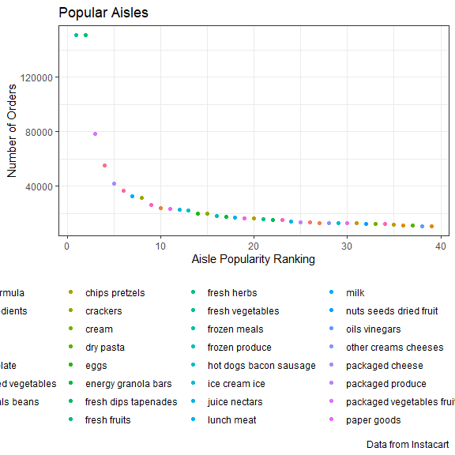

Homework 3
================
Lisa Eisler
10/8/2019

## Problem 1

*Read in instacart data*

``` r
library(p8105.datasets)
data("instacart")
instacart_data = instacart
```

The dataset from Instacart reflects online grocery orders. The data
contains 15 variables and 1384617 entries describing individual product
orders. Each entry refers to a specific product ordered, assigned a
product ID and description, and further lists the time of day of the
overall grocery order in which that product was included, the number of
days since a customer’s prior grocery order, and categorizes the product
by aisle and department.

*How many aisles are there, and which aisles are most items ordered
from?*

``` r
instacart_aisle = instacart_data %>%
  select(aisle) %>%
  count(aisle, name = "n_aisle") %>%
  arrange(desc(n_aisle))
```

There are 134 aisles. Most orders are from the “Fresh Vegetables” aisle,
followed in popularity by the “Fresh Fruits” and “Packaged Vegetables
Fruits” aisles.

*Make a plot that shows the number of items ordered in each aisle,
limiting this to aisles with more than 10000 items ordered.*

``` r
instacart_aisle_plot = instacart_aisle %>%
  filter(n_aisle > 10000) %>%
  mutate(
    rank = rank(-n_aisle)
  )

ggplot(instacart_aisle_plot, aes(x = rank, y = n_aisle)) +
    geom_point(aes(color = aisle)) +
    labs(
      title = "Popular Aisles",
      x = "Aisle Popularity Ranking",
      y = "Number of Orders",
      caption = "Data from Instacart"
    )
```



*Make a table showing the three most popular items in each of the aisles
“baking ingredients”, “dog food care”, and “packaged vegetables fruits”.
Include the number of times each item is ordered in your table.*

``` r
popular_items = instacart_data %>%
  select(aisle, product_name) %>%
  filter(aisle == "baking ingredients" | aisle == "dog food care" | aisle == "packaged vegetables fruits") %>%
  count(aisle, product_name, name = "n_product")
  
popular_items_table = popular_items %>%
  group_by(aisle) %>%
  mutate(
    rank = order(order(n_product, decreasing=TRUE))) %>%
  filter(rank < 4) %>%
  arrange(aisle, desc(n_product))

knitr::kable(
  popular_items_table, caption = 'Most Popular Items By Aisle.')
```

| aisle                      | product\_name                                 | n\_product | rank |
| :------------------------- | :-------------------------------------------- | ---------: | ---: |
| baking ingredients         | Light Brown Sugar                             |        499 |    1 |
| baking ingredients         | Pure Baking Soda                              |        387 |    2 |
| baking ingredients         | Cane Sugar                                    |        336 |    3 |
| dog food care              | Snack Sticks Chicken & Rice Recipe Dog Treats |         30 |    1 |
| dog food care              | Organix Chicken & Brown Rice Recipe           |         28 |    2 |
| dog food care              | Small Dog Biscuits                            |         26 |    3 |
| packaged vegetables fruits | Organic Baby Spinach                          |       9784 |    1 |
| packaged vegetables fruits | Organic Raspberries                           |       5546 |    2 |
| packaged vegetables fruits | Organic Blueberries                           |       4966 |    3 |

Most Popular Items By Aisle.
