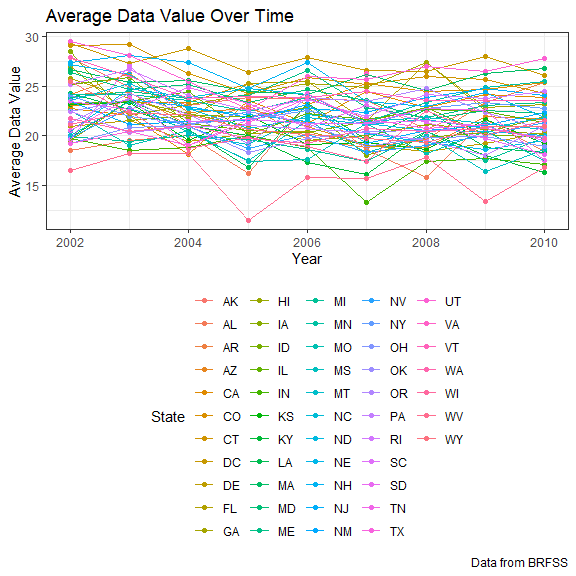

Homework 3
================
Lisa Eisler
10/14/2019

## Problem 1

*Read in instacart data*

``` r
library(p8105.datasets)
data("instacart")
instacart_data = instacart
```

The dataset from Instacart reflects online grocery orders. The data
contains 15 variables and 1384617 entries describing individual product
orders. Each entry refers to a specific product ordered, assigned a
product ID and description, and further lists the time of day of the
overall grocery order in which that product was included, the number of
days since a customer’s prior grocery order, and categorizes the product
by aisle and department.

*How many aisles are there, and which aisles are most items ordered
from?*

``` r
instacart_aisle = instacart_data %>%
  select(aisle) %>%
  count(aisle, name = "n_aisle") %>%
  arrange(desc(n_aisle))
```

There are 134 aisles. Most orders are from the “Fresh Vegetables” aisle,
followed in popularity by the “Fresh Fruits” and “Packaged Vegetables
Fruits” aisles.

*Make a plot that shows the number of items ordered in each aisle,
limiting this to aisles with more than 10000 items ordered.*

``` r
instacart_aisle_plot = instacart_aisle %>%
  filter(n_aisle > 10000) %>%
  mutate(
    rank = rank(-n_aisle)
  )

ggplot(instacart_aisle_plot, aes(x = rank, y = n_aisle)) +
    geom_point(aes(color = aisle)) +
    labs(
      title = "Popular Aisles",
      x = "Aisle Popularity Ranking",
      y = "Number of Orders",
      caption = "Data from Instacart"
    )
```


*Make a table showing the three most popular items in each of the aisles
“baking ingredients”, “dog food care”, and “packaged vegetables fruits”.
Include the number of times each item is ordered in your table.*

``` r
popular_items = instacart_data %>%
  select(aisle, product_name) %>%
  filter(aisle == "baking ingredients" | aisle == "dog food care" | aisle == "packaged vegetables fruits") %>%
  count(aisle, product_name, name = "n_product")
  
popular_items_table = popular_items %>%
  group_by(aisle) %>%
  mutate(
    rank = order(order(n_product, decreasing=TRUE))) %>%
  filter(rank < 4) %>%
  arrange(aisle, desc(n_product))

knitr::kable(
  popular_items_table, caption = 'Most Popular Items By Aisle.')
```

| aisle                      | product\_name                                 | n\_product | rank |
| :------------------------- | :-------------------------------------------- | ---------: | ---: |
| baking ingredients         | Light Brown Sugar                             |        499 |    1 |
| baking ingredients         | Pure Baking Soda                              |        387 |    2 |
| baking ingredients         | Cane Sugar                                    |        336 |    3 |
| dog food care              | Snack Sticks Chicken & Rice Recipe Dog Treats |         30 |    1 |
| dog food care              | Organix Chicken & Brown Rice Recipe           |         28 |    2 |
| dog food care              | Small Dog Biscuits                            |         26 |    3 |
| packaged vegetables fruits | Organic Baby Spinach                          |       9784 |    1 |
| packaged vegetables fruits | Organic Raspberries                           |       5546 |    2 |
| packaged vegetables fruits | Organic Blueberries                           |       4966 |    3 |

Most Popular Items By Aisle.

*Make a table showing the mean hour of the day at which Pink Lady Apples
and Coffee Ice Cream are ordered on each day of the week.*

``` r
apples_coffee_time = instacart_data %>% 
  select(product_name, order_dow, order_hour_of_day) %>%
  filter(product_name == "Pink Lady Apples" | product_name == "Coffee Ice Cream") %>%
  group_by(product_name, order_dow) %>%
  summarize(mean_hour = mean(order_hour_of_day)) %>%
  mutate(order_dow = case_when(
    order_dow == "0" ~ "Sunday",
    order_dow == "1" ~ "Monday",
    order_dow == "2" ~ "Tuesday",
    order_dow == "3" ~ "Wednesday",
    order_dow == "4" ~ "Thursday",
    order_dow == "5" ~ "Friday",
    order_dow == "6" ~ "Saturday")
    )

apple_coffee_table = apples_coffee_time %>% 
  pivot_wider(
    names_from = "order_dow",
    values_from = "mean_hour")

knitr::kable(
  apple_coffee_table, caption = 'Mean hour of the day for orders by day of the week.')
```

| product\_name    |   Sunday |   Monday |  Tuesday | Wednesday | Thursday |   Friday | Saturday |
| :--------------- | -------: | -------: | -------: | --------: | -------: | -------: | -------: |
| Coffee Ice Cream | 13.77419 | 14.31579 | 15.38095 |  15.31818 | 15.21739 | 12.26316 | 13.83333 |
| Pink Lady Apples | 13.44118 | 11.36000 | 11.70213 |  14.25000 | 11.55172 | 12.78431 | 11.93750 |

Mean hour of the day for orders by day of the week.

\#\#Problem 2

*Read in BRFSS data*

``` r
library(p8105.datasets)
data("brfss_smart2010")
```

*First, do some data cleaning*

``` r
brfss_smart2010_data = brfss_smart2010 %>%
  janitor::clean_names() %>% 
  filter(topic == "Overall Health") %>%
  filter(response == "Poor" | response == "Fair" | response == "Good" | response == "Very good" | response == "Excellent") %>%
  mutate(
    response_factor_ordered = factor(response, ordered = TRUE, levels = c("Poor", "Fair", "Good", "Very good", "Excellent"))
  )
```

*In 2002, which states were observed at 7 or more locations? What about
in 2010?*

``` r
brfss_location_2002 = brfss_smart2010_data %>%
  filter(year == 2002) %>%
  group_by(locationabbr) %>%
  summarise(
  n_locations = n_distinct(locationdesc))

knitr::kable(brfss_location_2002, caption = 'Number of Distinct Locations By State, 2002')
```

| locationabbr | n\_locations |
| :----------- | -----------: |
| AK           |            1 |
| AL           |            1 |
| AR           |            1 |
| AZ           |            2 |
| CA           |            1 |
| CO           |            4 |
| CT           |            7 |
| DC           |            1 |
| DE           |            3 |
| FL           |            7 |
| GA           |            3 |
| HI           |            4 |
| IA           |            1 |
| ID           |            2 |
| IL           |            3 |
| IN           |            2 |
| KS           |            3 |
| KY           |            1 |
| LA           |            3 |
| MA           |            8 |
| MD           |            6 |
| ME           |            2 |
| MI           |            4 |
| MN           |            4 |
| MO           |            2 |
| MS           |            1 |
| NC           |            7 |
| ND           |            1 |
| NE           |            3 |
| NH           |            5 |
| NJ           |            8 |
| NM           |            1 |
| NV           |            2 |
| NY           |            5 |
| OH           |            4 |
| OK           |            3 |
| OR           |            3 |
| PA           |           10 |
| RI           |            4 |
| SC           |            3 |
| SD           |            2 |
| TN           |            2 |
| TX           |            2 |
| UT           |            5 |
| VT           |            3 |
| WA           |            4 |
| WI           |            1 |
| WV           |            1 |
| WY           |            1 |

Number of Distinct Locations By State, 2002

``` r
brfss_location_2010 = brfss_smart2010_data %>%
  filter(year == 2010) %>%
  group_by(locationabbr) %>%
  summarise(
  n_locations = n_distinct(locationdesc))

knitr::kable(brfss_location_2010, caption = 'Number of Distinct Locations By State, 2010')
```

| locationabbr | n\_locations |
| :----------- | -----------: |
| AL           |            3 |
| AR           |            3 |
| AZ           |            3 |
| CA           |           12 |
| CO           |            7 |
| CT           |            5 |
| DC           |            1 |
| DE           |            3 |
| FL           |           41 |
| GA           |            4 |
| HI           |            4 |
| IA           |            2 |
| ID           |            6 |
| IL           |            2 |
| IN           |            3 |
| KS           |            4 |
| KY           |            1 |
| LA           |            5 |
| MA           |            9 |
| MD           |           12 |
| ME           |            6 |
| MI           |            4 |
| MN           |            5 |
| MO           |            3 |
| MS           |            2 |
| MT           |            3 |
| NC           |           12 |
| ND           |            3 |
| NE           |           10 |
| NH           |            5 |
| NJ           |           19 |
| NM           |            6 |
| NV           |            2 |
| NY           |            9 |
| OH           |            8 |
| OK           |            3 |
| OR           |            4 |
| PA           |            7 |
| RI           |            5 |
| SC           |            7 |
| SD           |            2 |
| TN           |            5 |
| TX           |           16 |
| UT           |            6 |
| VT           |            6 |
| WA           |           10 |
| WI           |            1 |
| WV           |            1 |
| WY           |            2 |

Number of Distinct Locations By State, 2010

In 2002, the states of CT, FL, NC, MA, NJ, & PA were observed at 7 or
more locations. In 2010, the states of CO, PA, SC, OH, MA, NY, NE, WA,
CA, MD, NC, TX, NJ, FL were observed at 7 or more locations.

*Construct a dataset that is limited to Excellent responses, and
contains, year, state, and a variable that averages the data\_value
across locations within a state. Make a “spaghetti” plot of this average
value over time within a state (that is, make a plot showing a line for
each state across years – the geom\_line geometry and group aesthetic
will help).*

``` r
excellent_responses_brfss = brfss_smart2010_data %>%
  filter(response == "Excellent") %>%
  rename(State = locationabbr) %>%
  group_by(State, year) %>%
  mutate(data_value_ave_state = mean(data_value)) %>%
  select(year, State, data_value_ave_state) %>%
  drop_na()

ggplot(excellent_responses_brfss, aes(x = year, y = data_value_ave_state, color = State)) +
    geom_point() +
    geom_line() +
    labs(
      title = "Average Data Value Over Time",
      x = "Year",
      y = "Average Data Value",
      caption = "Data from BRFSS"
    )
```



*Make a two-panel plot showing, for the years 2006, and 2010,
distribution of data\_value for responses (“Poor” to “Excellent”) among
locations in NY State.*

``` r
data_value_response_brfss = brfss_smart2010_data %>%
  filter(year == 2006 | year == 2010) %>%
  filter(locationabbr == "NY")

ggplot(data_value_response_brfss, aes(x = response_factor_ordered, y = data_value)) + 
  geom_boxplot() +
  facet_grid(. ~ year) +
  labs(
      title = "Distribution of Data Value By Response - Box Plot",
      x = "Response",
      y = "Data Values",
      caption = "Data from BRFSS"
  )
```


``` r
ggplot(data_value_response_brfss, aes(x = response_factor_ordered, y = data_value)) + 
  geom_violin(aes(fill = response_factor_ordered), color = "blue", alpha = .5) + 
  stat_summary(fun.y = median, geom = "point", color = "blue", size = 4) +
  labs(
      title = "Distribution of Data Value By Response - Violin Plot",
      x = "Response",
      y = "Data Values",
      caption = "Data from BRFSS"
  )
```


## Problem 3

*Load accelerometer data: This data set has 5 weeks worth of
accelerometer data from a 63 year old man with congestive heart failure
admitted to CUMC.*

``` r
accel_data = read_csv("./accel_data.csv") %>% 
  janitor:: clean_names()
```

    ## Parsed with column specification:
    ## cols(
    ##   .default = col_double(),
    ##   day = col_character()
    ## )

    ## See spec(...) for full column specifications.

*Tidy data to create a data set consisting of the following variables:
week (1-5), day\_of\_week (Sunday - Saturday, as ordered variable),
day\_type (weekday or weekend), hour\_of\_day (0-23), minute\_of\_day
(1-1440), and activity\_count, which counts the activities that occured
during a particular minute.*

``` r
accel_data_tidy = accel_data %>%
  pivot_longer(
  activity_1:activity_1440, 
  names_to = "minute", 
  names_prefix = "activity_", 
  values_to = "activity_count") %>% 
  mutate(
  day_type = ifelse(day %in% c("Saturday", "Sunday"), "weekend", "weekday"),
  day_ordered = factor(day, ordered = TRUE, levels = c("Sunday", "Monday", "Tuesday", "Wednesday", "Thursday", "Friday", "Saturday")),
  minute_of_day = as.numeric(minute),
  hour_of_day = as.integer(minute_of_day/60)
  ) %>%
  select("week", "day_ordered", "day_type", "minute_of_day", "hour_of_day", "activity_count") %>%
  arrange(week, day_ordered)
```

The data set contains 50400 observations. This is the expected number of
minutes in a 5 week period of time.

*Using your tidied dataset, aggregate across minutes to create a total
activity variable for each day, and create a table showing these totals.
Are any trends apparent?*

Please note: unclear whether instructions are to aggregate data for each
day of week across five weeks. The code below interprets day as unique
day of study (35 total days).

``` r
activity_total_table = accel_data_tidy %>% 
  group_by(week, day_ordered) %>% 
  summarize(total_activity_day = sum(activity_count)) %>%
  select(week, day_ordered, total_activity_day)

knitr::kable(activity_total_table, caption = 'Daily Total Activity for Patient')
```

| week | day\_ordered | total\_activity\_day |
| ---: | :----------- | -------------------: |
|    1 | Sunday       |            631105.00 |
|    1 | Monday       |             78828.07 |
|    1 | Tuesday      |            307094.24 |
|    1 | Wednesday    |            340115.01 |
|    1 | Thursday     |            355923.64 |
|    1 | Friday       |            480542.62 |
|    1 | Saturday     |            376254.00 |
|    2 | Sunday       |            422018.00 |
|    2 | Monday       |            295431.00 |
|    2 | Tuesday      |            423245.00 |
|    2 | Wednesday    |            440962.00 |
|    2 | Thursday     |            474048.00 |
|    2 | Friday       |            568839.00 |
|    2 | Saturday     |            607175.00 |
|    3 | Sunday       |            467052.00 |
|    3 | Monday       |            685910.00 |
|    3 | Tuesday      |            381507.00 |
|    3 | Wednesday    |            468869.00 |
|    3 | Thursday     |            371230.00 |
|    3 | Friday       |            467420.00 |
|    3 | Saturday     |            382928.00 |
|    4 | Sunday       |            260617.00 |
|    4 | Monday       |            409450.00 |
|    4 | Tuesday      |            319568.00 |
|    4 | Wednesday    |            434460.00 |
|    4 | Thursday     |            340291.00 |
|    4 | Friday       |            154049.00 |
|    4 | Saturday     |              1440.00 |
|    5 | Sunday       |            138421.00 |
|    5 | Monday       |            389080.00 |
|    5 | Tuesday      |            367824.00 |
|    5 | Wednesday    |            445366.00 |
|    5 | Thursday     |            549658.00 |
|    5 | Friday       |            620860.00 |
|    5 | Saturday     |              1440.00 |

Daily Total Activity for Patient

``` r
ggplot(activity_total_table, aes(x = day_ordered, y = total_activity_day)) +
  geom_point() +
  facet_grid(. ~ week) +
  labs(
    title = "Daily Total Activity for Patient, Weeks 1-5",
    x = "Day of Week",
    y = "Total Activity",
    caption = "Accelerometer Data"
  )
```


I do not observe any clear patterns across the five weeks as illustrated
by the 5 panel plot. It appears for weeks 1, 2, and 5 that activity
level increases from Monday to Friday, with an unpredictable level of
activity over the weekend. Weeks 3 and 4 do not display this pattern.

*Accelerometer data allows the inspection activity over the course of
the day. Make a single-panel plot that shows the 24-hour activity time
courses for each day and use color to indicate day of the week. Describe
in words any patterns or conclusions you can make based on this graph.*

Please note: Unable to make a readable single-panel plot which contains
24hr activity for each unique day of the study. Therefore, I’m assuming
question is looking for hourly data aggregated across days of the week
(5 weeks worth of Sunday data, 5 weeks worth of Monday data, etc).

``` r
time_course_24hr_plot = accel_data_tidy %>%
  group_by(day_ordered, hour_of_day) %>% 
  summarize(total_activity_hour = sum(activity_count)) %>%
  select(day_ordered, hour_of_day, total_activity_hour) %>%
  arrange(day_ordered, hour_of_day)
  
ggplot(time_course_24hr_plot, aes(x = hour_of_day, y = total_activity_hour, color = day_ordered)) + 
  geom_line() + 
  labs(
    title = "Activity Counts Over 24 Hour Period, by Day of Week",
    x = "Hour of Day",
    y = "Activity Count",
    caption = "Accelerometer Data"
   )
```


Activity falls after hour 20 (8pm) and is almost zero until hour 5
(5am), reflecting a period of overnight sleep. Moderate activity levels
are fairly consistent from one day to the next during the afternoon
hours. A variable spike in activity level is observed at roughly hours
8-9 (8-9am) and hours 19 (7pm) perhaps reflecting morning and evening
activity such as working with therapy personnel (likely am) and perhaps
hygiene or dining (am and pm).
